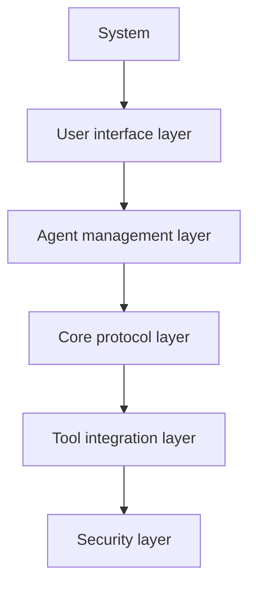
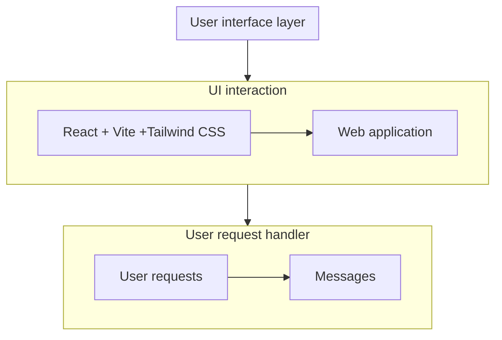
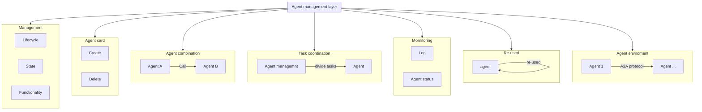
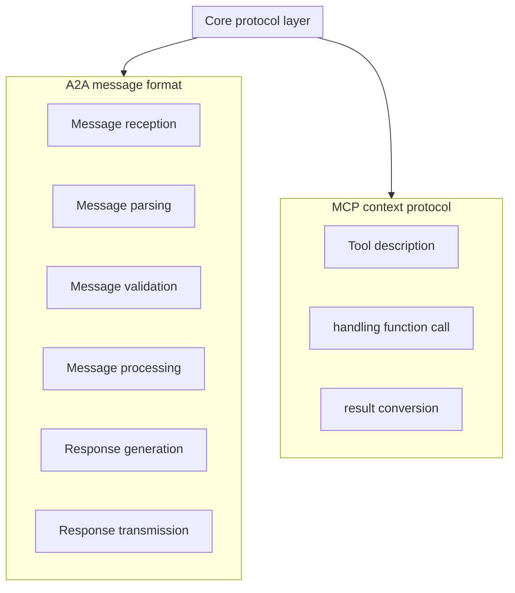
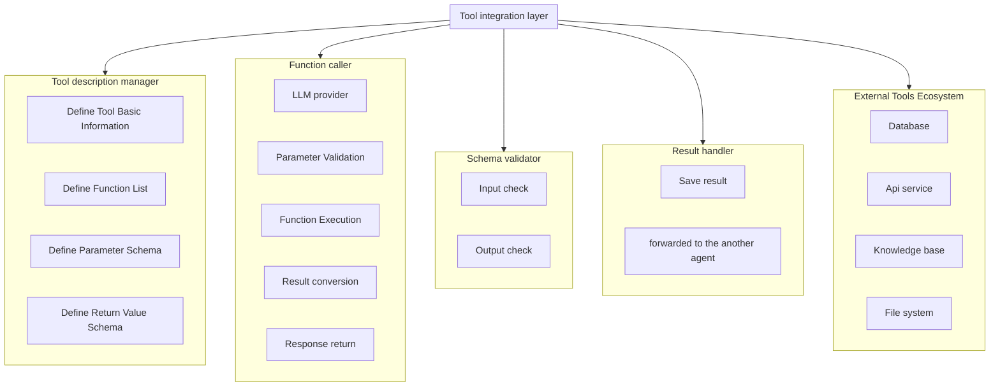
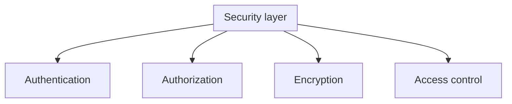

# 🌐 PRAISE

Thì đây sẽ là dự án triển khai integration among A2A and MCP, và chỉ là một project self-study nên mình sẽ cố gắng hết sức.

Project sẽ về Pentest web với phần chính chủ yếu về recon

## System architecture

Hệ thống tích hợp này sẽ gồm có 5 layer chính như sau :

Chúng ta có thể thấy đó là 5 layer này chịu trách nhiệm cho 5 nhiệm vụ khác nhau, những layer này bổ sung cho nhau, góp phần tạo nên hệ thống, thiếu một trong số trong không thể nào hoàn thành hệ thống được.

### User interface layer

Lớp giao diện này để người dùng tương tác với hệ thống, sử dụng React/Vite + Tailwind CSS để xây dựng giao diện. Chủ yếu xử lí đầu vào của người dùng là văn bản.

Đơn giản thì mình muốn xây dựng một giao diện giúp người dùng dễ dàng giao tiếp với hệ thống agent và tiếp nhận và phân tích yêu cầu người dùng để gửi xuống các lớp bên dưới.

### Agent management layer

Lớp này sẽ làm nhiệm vụ quản lý agent bao gồm các vòng đời ,trạng thái, các chức năng của agent, quản lý tạo, xóa các agent card, điều phối những agent giao tiếp với nhau, những agent có thể cộng tác linh hoạt qua tự động khám quá agent và kết nối thông qua khả năng đàm phán. (mình cũng khá khó hiểu khúc khả năng đàm phán này :v)

### Core protocol layer

Lớp này sẽ làm nhiệm vụ triển khai cơ bản giao thức A2A và MCP, cung cấp những chức năng cốt lõi như message formats, communication rules, error handling, giao tiếp với các công cụ bên ngoài theo mô hình MCP, quản lí các artifact sinh ra từ task sau khi hoàn thành, theo giỏi.

### Tool integration layer

Lớp này sẽ kết hợp các công cự và các api thông qua mcp, chúng quản lí tool và xử lí goi hàm.

### Security layer

Lớp này sẽ chịu trách nhiệm về việc bảo nhật giao tiếp giữa các agent và công cụ sử dụng, xử lý xác thực, ủy quyền, và mã hóa dữ liệu.

